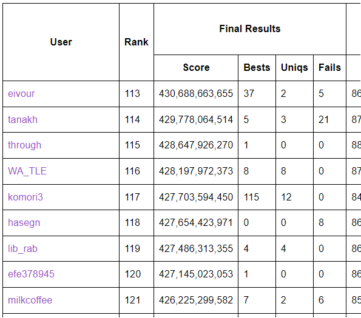

# AHC025

<!-- @import "[TOC]" {cmd="toc" depthFrom=1 depthTo=6 orderedList=false} -->

<!-- code_chunk_output -->

- [AHC025](#ahc025)
  - [10/14](#1014)
    - [問題を見る](#問題を見る)
    - [一投目](#一投目)
  - [10/15](#1015)
    - [二投目](#二投目)
    - [三投目](#三投目)
    - [比較回数を最小化するソート](#比較回数を最小化するソート)
    - [四投目](#四投目)
  - [10/16](#1016)
    - [~七投目](#七投目)
    - [八投目](#八投目)
  - [10/17](#1017)
    - [11投目](#11投目)
    - [解法選択に logistic regression](#解法選択に-logistic-regression)
    - [12投目](#12投目)
  - [10/18](#1018)
    - [number partitioning problem と longest processing time heuristics](#number-partitioning-problem-と-longest-processing-time-heuristics)
    - [14投目](#14投目)
  - [~10/21](#1021)
    - [過去のクエリを利用して比較をサボる方法(不採用)](#過去のクエリを利用して比較をサボる方法不採用)
  - [10/22](#1022)
  - [感想](#感想)

<!-- /code_chunk_output -->

---

## 10/14

### 問題を見る

推定系が出て頭を抱える

### 一投目

* **クエリ:**
  * 全アイテムからなる集合を二分割して天秤に乗せる操作を Q 回繰り返す
  * 条件が Q 個得られる
* **重み推定:**
  * 入力生成方法に従って重み配列をランダム生成することを繰り返し、満たす条件数が多くなるよう山登りする
* **分割:**
  * 得られた重み配列を D グループに分配 (mod D で)
  * 山登りで等分
    * 1 アイテムを他グループに移動
    * 2 つのグループから各 1 つずつアイテムを選び、交換
* **提出:**
  * https://atcoder.jp/contests/ahc025/submissions/46516234
  * 2290075965

---

## 10/15

### 二投目

* **クエリ:** [一投目](#一投目)と同様
* **重み推定:**
  * 入力生成方法に従って重み配列をランダム生成して初期解とする
  * 満たす条件数が多くなるよう、アイテムの重みを一点変更・二点交換で山登りする
* **分割:**: [一投目](#一投目)と同様
* **提出:**
  * https://atcoder.jp/contests/ahc025/submissions/46593907
  * 1179176525

### 三投目

* **クエリ:**
  * 全アイテムからなる集合を二分割して天秤に乗せる操作を Q 回繰り返す
  * 二分割のサイズに -2~2 のゆらぎを持たせる
* **重み推定:** [二投目](#二投目)と同様
* **分割:**: [一投目](#一投目)と同様
* **提出:**
  * https://atcoder.jp/contests/ahc025/submissions/46596978
  * 1131091655

---

### 比較回数を最小化するソート

色々調べると [Merge-insertion sort (Ford-Johnson algorithm)](https://en.wikipedia.org/wiki/Merge-insertion_sort) が比較回数において優れていることがわかる

* [A001768](https://oeis.org/A001768): Sorting numbers: number of comparisons for merge insertion sort of n elements.
* [A036604](https://oeis.org/A036604): Sorting numbers: minimal number of comparisons needed to sort n elements.
  * 最適解: 先頭 15 項までしか乗っていない

取り回しの効く実装が Web に落ちていなかったので、自前で実装したら時間がかかってしまった

下記に 21 要素のソート例が載っており、参考になった
* Knuth, Donald E. (1998), "Merge insertion", The Art of Computer Programming, Vol. 3: Sorting and Searching (2nd ed.), pp. 184–186

---

### 四投目

* `A001768(N) <= Q` の場合
  * Ford-Johnson algorithm で N アイテムを並び替える
  * 残りのターンで[三投目](#三投目)同様のクエリを投げる
  * 全実行時間の 75% を使って以下を実行
    * 入力生成方法に従って**ソートされた**重み配列をランダム生成することを繰り返す
    * 満たす条件が多くなるように山登り
  * 分割方法は[三投目](#三投目)と同様
* それ以外
  * [三投目](#三投目)と同様
* **提出:**
  * https://atcoder.jp/contests/ahc025/submissions/46616705
  * 622417139

---

## 10/16

### ~七投目

ソートされた重み配列の山登りを工夫したり焼きなましに変更したりしてみたが、効果は薄い

### 八投目

クエリ数 Q の制約が厳しいときは、`A001768(K) <= Q`を満たす最大の K を探して、N 個のアイテムを予め K 個に分割してからソートすればよい

* **提出**
  * https://atcoder.jp/contests/ahc025/submissions/46650346
  * 303664289

---

## 10/17

### 11投目

* `A001768(K) <= Q * 3 / 5 && K <= N` を満たす最大の K を決めて、アイテムを K 分割してソート
* D 個のグループにソート済みの要素を**降順・蛇腹状**に分配する
* N, D, Q の値に応じて、以下の 2 つのアルゴリズムのよい方を選択する
  1. 2 グループを選択して重みを比較し、重い方に含まれる最小要素を軽い方に移動させることを繰り返す
  2. D グループの重みを Merge-insertion sort で比較し、最大重みグループの最小要素を最小重みグループに移動させることを繰り返す
* **提出**:
  * https://atcoder.jp/contests/ahc025/submissions/46671830
  * 231362559

### 解法選択に logistic regression

2 アルゴリズムの選択には 10000 ケースの実行結果を用いてロジスティック回帰を使ってみた
* https://qiita.com/0NE_shoT_/items/b702ab482466df6e5569
* https://blog.amedama.jp/entry/2018/08/26/095444
* [てきとうコード](scripts/logistic_regression.py)

相変わらず何もわからないが、スコアが上がったのでヨシ

---

### 12投目

D 個のグループにソート済みの要素を**降順・蛇腹状**に分配していたが、これをもう少しマシにする
* 入力生成方法に従って K 要素の**ソート済み**重み配列を得ることを繰り返し、その平均値を暫定的な重みとする
* 暫定的な重みに基づいてグループへの分配を山登りで最適化し、得られた分配を初期状態とする
* 初期状態から[11投目](#11投目)で述べた 2 つのアルゴリズムを実行する
* **提出:**
  * https://atcoder.jp/contests/ahc025/submissions/46674536
  * 194475449

---

## 10/18

### number partitioning problem と longest processing time heuristics

重みが陽にわかる場合は[数分割問題(number partitioning probrem)](https://scmopt.github.io/opt100/76npp.html) の分割が 3 以上のケースに該当する

[複数装置スケジューリング問題](https://scmopt.github.io/opt100/76npp.html#%E8%A4%87%E6%95%B0%E8%A3%85%E7%BD%AE%E3%82%B9%E3%82%B1%E3%82%B8%E3%83%A5%E3%83%BC%E3%83%AA%E3%83%B3%E3%82%B0%E5%95%8F%E9%A1%8C)と見なすことができて、**longest processing time (LPT) heuristics** を用いることでよい近似解を得られるらしい

重みの大きい要素から順に重みの和が最小のグループに振り分けることを繰り返すだけで、今回の問題と相性が良さそう

思えば、**降順・蛇腹状**の分配が良いスコアを出したのは LPT heuristics と序盤の分配が似ているからかもしれない

---

### 14投目

Merge-insertion sort した K 要素を LPT heuristics に従いグループに分配していく

重み最小グループの判定は高々 D-1 回の比較で行えるが、比較回数の節約のためにグループの大小関係を根付き木で保持しておく（小->大に向けて辺を張る）

* 要素を降順にキューに詰める
* 最初の D 要素をキューから取り出し、各グループに分配する
  * 比較は必要なく、根付き木はパスになる
* 以下を繰り返す
  * キューから先頭要素を取り出し、根に分配する
  * キューが空なら余計な比較をしないよう break する
  * 根の重さが不明になったので、根から出る辺を削除する
  * 根付き森？ができるので、根同士の大小を比較してマージする
    * (根の個数-1) 回の比較が発生

N, D に対して実験的に比較回数の上限 `cmp[N][D]` を求めておき、`A001768(K) + cmp[K][D] <= Q && K <= N` を満たす最大の K に対して上記アルゴリズムを実行して解を得る

* **提出**:
  * https://atcoder.jp/contests/ahc025/submissions/46694346
  * 117702800

この時点で 45 位 90G くらい、ようやくスタートラインに立った気がする

---

要素圧縮なしで LPT heuristics を完遂可能なテストケースのみ AC するコードを投げた
* 48AC でスコア 43173120729、**89.9%** 程度
* 直前のスコアは 89741457861
* 残り 52 case の順位は (89741457861 - 43173120729) / 52 / 1e9 * 100 = **89.5%** 程度

どうしよう　ほとんど差がありませんが…

---

## ~10/21

### 過去のクエリを利用して比較をサボる方法(不採用)

無駄な比較をしない方法をずっと考えていた

例えば、`N=5` として過去のクエリから `0<w0<w1<w2<w3<w4` であることが分かっているとすると、`w0+w2<w1+w4` であることはクエリを投げずともわかる

不等式を整理すると
```
(0) w0            >0
(1)    w1         >0
(2)       w2      >0
(3)          w3   >0
(4)             w4>0
(5)-w0+w1         >0
(6)   -w1+w2      >0
(7)      -w2+w3   >0
(8)         -w3+w4>0
--------------------
(T)-w0+w1-w2   +w4>0
```

で、`(5)+(7)+(8) = (T)`となるので、`w0+w2`と`w1+w4`の大小判定は不要

不等式を上記のように整理して係数のみのベクトルを考える。`i`番目の不等式に対応するベクトルを`a_i`、調べたい不等式に対応するベクトルを`b`とする。例えば`a_7={0,0,-1,1,0}, b={-1,1,-1,0,1}`。

このとき、

`Σ(a_i*x_i)=b, i<N, x_i>=0`

が成立するかどうか判定できれば比較の要否が判明する。

これは線形計画問題の実行可能解を求めればよく、二段階 simplex 法の第一段階を解けばよい
* 詳細は http://www.me.titech.ac.jp/~mizu_lab/text/PDF-LP/LP3-simplex.pdf の p.21 以降等を参照

---

めでたく simplex 法で比較の要否が判定できることは分かったが、PDF を漁って学部時代の朧げな記憶を掘り返したり計算誤差の蓄積で無限にバクらせたりしている間に 2~3 日が経過してしまった

結局最終提出に反映はできず、コンテスト期間中に LP ソルバを自前で用意するのは無謀だったかもしれないと反省…

## 10/22

最終日になってしまったので少しでもマシなスコアを得る方法を考える

[数分割問題(number partitioning probrem)](https://scmopt.github.io/opt100/76npp.html) のページには [LPT heuristics](https://scmopt.github.io/opt100/76npp.html#longest_processing_time) の他にも[差分法](https://scmopt.github.io/opt100/76npp.html#%E5%B7%AE%E5%88%86%E6%B3%95)というのが載っている

分割数が 3 以上の場合の解法が読んでもいまいち理解できなかったので、もう少し分かりやすい説明は無いかなと探したら [Wikipedia の Largest Differencing Method(LDM) のページ](https://en.wikipedia.org/wiki/Largest_differencing_method) に行き着いた

どうも LDM は LPT と比較して平均的に良い性能を叩き出すらしく、重み既知として実際に実験したところ正しそうなことが分かったので最後にこれを実装することにした

気合で終了二時間までに実装を終え、LDM と LPT のよい方（入力と同じ N,D,Q で大量に生成した問題を 1.7sec 解いて、平均的に良かった方）を採用するようにして最終提出した

* **提出**:
  * https://atcoder.jp/contests/ahc025/submissions/46855015
  * 119794880

---

## 感想

最終順位は 117/1085 でレート変動ゼロ　心が折れる



[siman さんの統計情報のページ](https://siman-man.github.io/ahc_statistics/025/) を見ると順位の割にやたらと bests が多かった(上から数えて 9 番目)

多分 LPT, LDM 等がクエリ回数ギリギリで走るようなケースで当たりを引いてそう

実際に LDM が上手く行ったのか 5000 ケース中の 1% くらいは理論値`Score=1`が出ていた

---

上位勢は局所探索をしている人が多かった　そ、そんな…

局所探索(アイテムの移動や交換等)で改善したか判定する方法は少し考えれば出てくるはずなのに、ろくに考えようともせず simplex 法とか明後日の方向に突っ走ってしまったのが敗因かも

とはいえコンテスト中の学びがそこそこあったのは良かったと思う（思わないとやってられん）